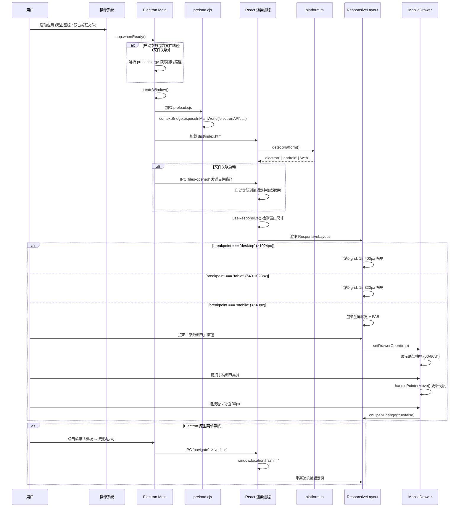
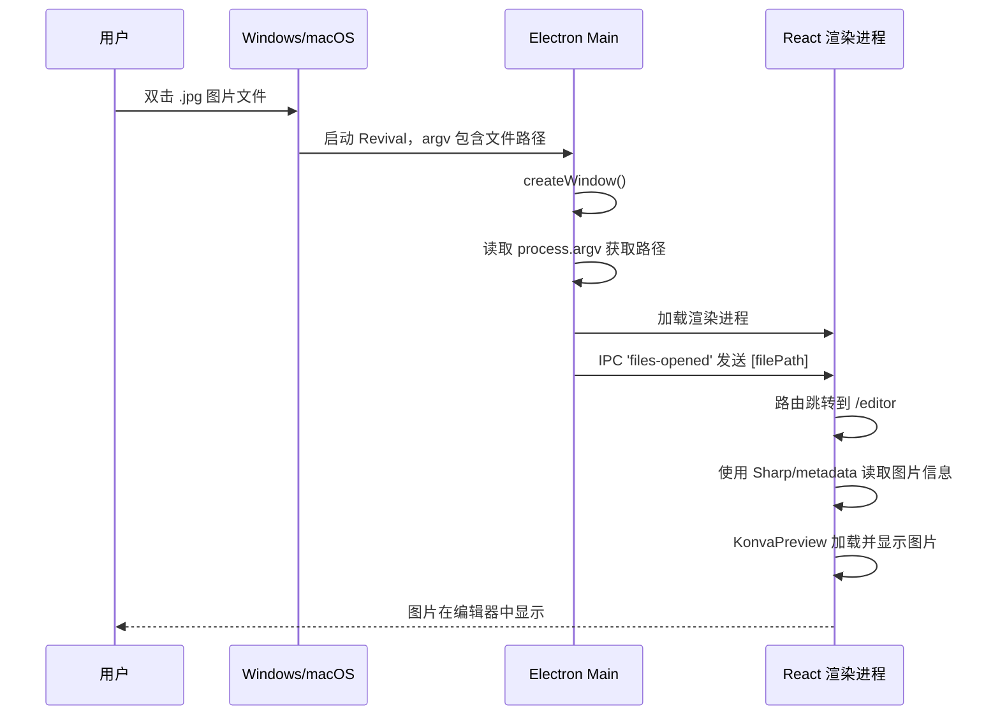
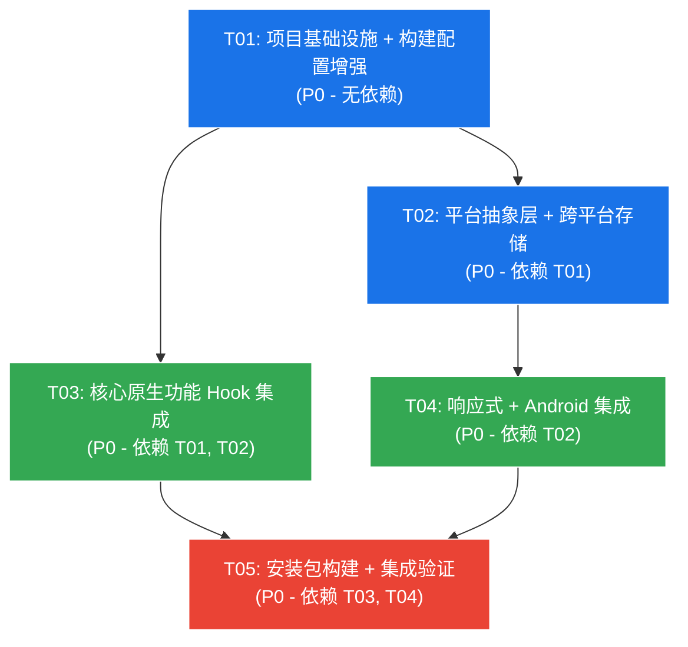

# Revival 跨平台架构设计

> **版本**：v1.0  
> **日期**：2025-07-17

---

## Part A: 系统设计

---

### 1. 实现方案与框架选型

#### 1.1 核心技术挑战

| 挑战 | 说明 | 解决方案 |
|------|------|---------|
| **分层架构** | 同一份 React 代码需运行在 Electron 桌面端、Capacitor Android 端和 Web 端，不同平台调用不同原生 API | 平台抽象层（PlatAgnostic Layer）统一接口，运行时检测 + 条件分支 |
| **原生能力桥接** | 系统托盘、原生菜单、任务栏进度等 Electron-only 能力不能侵入渲染进程 | 全部在 `main.cjs` 主进程实现，通过预加载脚本暴露 IPC 通道 |
| **Sharp 原生处理 vs Web Canvas** | Sharp 运行在 Node 主进程，渲染进程通过 IPC 调用，结果需回传到 Canvas 展示 | 「IPC 请求 → 主进程处理 → Buffer → Base64 → 渲染进程加载」单向数据流 |
| **移动端适配** | 同一组件在 320px 手机和 1920px 桌面表现不同 | 三断点响应式体系 + 平台条件渲染 + 底部抽屉替换侧栏 |
| **文件关联** | 双击图片文件启动应用并加载该图片 | `electron-builder` 注册文件类型 → `process.argv` 解析 → IPC 通知渲染进程 |

#### 1.2 架构分层图

```
┌──────────────────────────────────────────────────────────┐
│                    Presentation Layer                      │
│  React 18 + TypeScript + Tailwind CSS + MUI               │
│  ┌────────────┐ ┌──────────────┐ ┌────────────────────┐  │
│  │  Page组件   │ │  通用组件     │ │ 响应式布局容器     │  │
│  │  6 Pages   │ │  12 Components│ │ ResponsiveLayout  │  │
│  └────────────┘ └──────────────┘ └────────────────────┘  │
├──────────────────────────────────────────────────────────┤
│                  Platform Agnostic Layer                   │
│  ┌────────────┐ ┌──────────────┐ ┌────────────────────┐  │
│  │ platform.ts│ │useResponsive │ │usePlatformUpload   │  │
│  │ 平台检测    │ │ 断点Hook     │ │ 平台感知上传       │  │
│  └────────────┘ └──────────────┘ └────────────────────┘  │
├──────────────────────────────────────────────────────────┤
│               IPC Bridge (Context Isolation)               │
│  ┌─────────────────────────────────────────────────────┐  │
│  │  preload.cjs — 20+ IPC 通道暴露为 window.electronAPI │  │
│  └─────────────────────────────────────────────────────┘  │
├──────────────────────────────────────────────────────────┤
│                   Electron Main Process                    │
│  ┌──────┐ ┌──────┐ ┌──────┐ ┌──────┐ ┌───────────────┐  │
│  │托盘  │ │菜单  │ │文件  │ │任务栏 │ │Sharp          │  │
│  │Tray  │ │Menu  │ │Dialog│ │进度  │ │图片处理       │  │
│  └──────┘ └──────┘ └──────┘ └──────┘ └───────────────┘  │
│  ┌──────────┐ ┌──────────────┐                           │
│  │自动更新   │ │ 窗口管理     │                           │
│  │Updater   │ │ BrowserWindow│                           │
│  └──────────┘ └──────────────┘                           │
├──────────────────────────────────────────────────────────┤
│               Capacitor Android Bridge                    │
│  ┌─────────────┐ ┌──────────────┐ ┌──────────────────┐  │
│  │ Capacitor   │ │ Capacitor    │ │ Capacitor        │  │
│  │ Core        │ │ Filesystem   │ │ Preferences      │  │
│  └─────────────┘ └──────────────┘ └──────────────────┘  │
└──────────────────────────────────────────────────────────┘
```

#### 1.3 框架选型及理由

| 框架/库 | 版本 | 理由 |
|---------|------|------|
| **Vite 5** | ^5.4.2 | 极速 HMR，原生 ESM，构建分包支持良好 |
| **React 18** | ^18.3.1 | 现有项目基础，Concurrent 特性对响应式有利 |
| **Tailwind CSS 3** | ^3.4.3 | 响应式断点原子类，零运行时开销 |
| **Electron 31** | ^31.0.2 | 最新稳定版，Context Isolation 安全模型 |
| **electron-builder 24** | ^24.13.3 | NSIS/macOS/Linux 全平台打包，文件关联配置 |
| **electron-updater 6** | ^6.3.0 | 自动更新，支持 Generic/S3/GitHub 源 |
| **Sharp 0.33** | ^0.33.5 | 原生图片处理，速度比 Web Canvas 快 3-10 倍 |
| **Capacitor 6** | ^6.1.0 | Android WebView 容器，原生插件生态 |
| **React Router 7** | ^7.15.0 | HashRouter 兼容 Electron file:// 协议 |
| **exifr** | ^7.1.3 | 零依赖 EXIF 提取，支持多种相机格式 |
| **vite-plugin-pwa** | ^1.3.0 | PWA Service Worker + manifest 注入 |

#### 1.4 架构模式

- **主架构模式**：分层架构（Layered Architecture）+ 平台抽象（Platform Abstraction）
- **跨进程通信**：IPC 请求-响应模式（invoke/handle）+ 事件推送模式（on/send）
- **UI 模式**：容器-展示组件模式（Container-Presentational），配合响应式布局容器
- **构建模式**：Vite 分包策略（vendor/konva/editor），减小首屏加载

---

### 2. 文件列表

#### 2.1 已有文件（已就位，无需创建）

```
electron/
├── main.cjs              # 主进程：托盘/菜单/Sharp/IPC/自动更新/任务栏进度
├── preload.cjs            # 预加载脚本：暴露 electronAPI 桥接对象

src/
├── main.tsx               # 应用入口
├── AppRouter.tsx           # HashRouter + 6 路由
├── platform.ts             # 平台检测工具 (electron/android/ios/web)
├── index.css               # 全局样式 + 响应式 + 触摸优化

├── components/
│   ├── index.ts            # 组件 barrel export
│   ├── TitleBar.tsx         # 自定义标题栏 (macOS 圆点)
│   ├── ResponsiveLayout.tsx # 响应式布局容器 (桌面/平板/手机)
│   ├── MobileDrawer.tsx     # 手机端底部可拖拽抽屉
│   ├── KonvaPreview.tsx     # Konva Canvas 预览
│   ├── Collapse.tsx         # 折叠面板
│   ├── Slider.tsx           # 滑杆控件
│   ├── Toggle.tsx           # 开关控件
│   ├── ColorPicker.tsx      # 颜色选择器
│   ├── FontSelector.tsx     # 字体选择器
│   ├── ExportScaleSelector.tsx # 导出比例选择器
│   ├── Draggable.tsx        # 拖拽容器
│   └── ... (其他已有组件)

├── hooks/
│   ├── useResponsive.ts     # 响应式断点 Hook
│   └── usePlatformUpload.tsx # 平台感知文件上传

├── pages/
│   ├── LoadingPage.tsx      # 启动加载页
│   ├── TemplateSelectPage.tsx # 模板选择页
│   ├── EditorPage.tsx        # 光影边框编辑器
│   ├── HasselbladPage.tsx    # 哈苏风编辑器
│   ├── XiaomiPage.tsx        # 小米风编辑器
│   └── CardParamsPage.tsx    # 卡片参数编辑器

├── utils/
│   └── imageHelpers.ts      # 图片辅助工具

├── styles/
│   └── editor-layout.css    # 编辑器布局样式

├── constants/               # 常量定义
├── assets/                  # 静态资源
└── App.css                  # 应用样式 (旧)

public/
├── icon.ico                 # Windows 应用图标
├── icon.icns                # macOS 应用图标
├── icon.png                 # Linux 应用图标
├── manifest.json            # PWA 清单
└── favicon.svg              # Favicon

capacitor.config.json        # Capacitor 配置
vite.config.ts               # Vite 构建配置 (分包已配置)
package.json                 # 依赖 + electron-builder 构建配置
tsconfig.json                # TypeScript 配置
tailwind.config.js           # Tailwind 配置
postcss.config.js            # PostCSS 配置
```

#### 2.2 需新建或修改的文件

```
# === 新增文件 ===

# 平台抽象层 - 存储抽象
src/storage.ts                # 跨平台存储封装 (Electron: electron-store / Android: Capacitor Preferences / Web: localStorage)

# 平台抽象层 - 平台感知组件
src/components/PlatformGuard.tsx  # 平台守卫组件 (仅某平台显示/隐藏)

# 桌面端 - IPC 类型定义 (渲染进程侧)
src/types/electron.d.ts         # electronAPI 完整类型声明 (自动更新/对话框/Sharp/进度等)

# 桌面端 - 自动更新 UI 组件
src/components/UpdateManager.tsx # 自动更新状态提示条/弹窗组件

# 桌面端 - 任务栏进度集成
src/hooks/useTaskbarProgress.ts  # 任务栏进度 Hook (封装 setProgressBar)

# 桌面端 - Sharp 图片处理
src/hooks/useSharpProcessor.ts   # Sharp IPC 调用封装 Hook

# 桌面端 - EXIF 提取 (Sharp 增强)
src/hooks/useExifData.ts         # EXIF 数据提取 Hook (桌面用 Sharp, 网页用 exifr)

# 移动端 - Capacitor 文件选择
src/hooks/useCapacitorPicker.ts  # Capacitor 原生文件选择器封装

# 构建配置 - Electron 打包
electron-builder.yml             # electron-builder YAML 配置 (替代 package.json 中的 build 字段)

# PWA - Service Worker
public/sw.js                     # Service Worker 离线缓存

# 文档
docs/sequence-diagram.mermaid    # 时序图
docs/class-diagram.mermaid       # 类图


# === 需修改文件 ===

electron/main.cjs                # [已完成] 无需修改
electron/preload.cjs             # [已完成] 无需修改

src/main.tsx                     # 添加 PWA 注册 + UpdateManager 挂载
src/AppRouter.tsx                # 添加 UpdateManager + PlatformGuard 集成
src/platform.ts                  # [已完成] 无需修改
src/index.css                    # [已完成] 无需修改

vite.config.ts                   # 添加 PWA 插件配置
package.json                     # [已完成] 无需修改
capacitor.config.json            # [已完成] 无需修改
```

---

### 3. 数据结构与接口（类图）

```mermaid
classDiagram

    %% ===== 平台抽象层 =====
    class PlatformUtil {
        <<static>>
        +detectPlatform() RevivalPlatform
        +isElectron() boolean
        +isMobile() boolean
        +isAndroid() boolean
        +isTouchDevice() boolean
    }
    <<interface>> RevivalPlatform
    RevivalPlatform : electron
    RevivalPlatform : android
    RevivalPlatform : ios
    RevivalPlatform : web

    class ResponsiveInfo {
        +breakpoint Breakpoint
        +platform RevivalPlatform
        +isTouch boolean
        +isMobile boolean
        +isTablet boolean
        +isDesktop boolean
        +width number
        +height number
        +orientation "portrait" | "landscape"
    }
    <<interface>> ResponsiveInfo

    class Breakpoint {
        <<enum>>
        mobile
        tablet
        desktop
    }

    %% ===== 跨平台存储 =====
    class StorageService {
        <<interface>>
        +get(key string) Promise~T|null~
        +set(key string, value T) Promise~void~
        +remove(key string) Promise~void~
        +clear() Promise~void~
    }
    class ElectronStorage {
        +get(key string) Promise~T|null~
        +set(key string, value T) Promise~void~
        +remove(key string) Promise~void~
        +clear() Promise~void~
    }
    class CapacitorStorage {
        +get(key string) Promise~T|null~
        +set(key string, value T) Promise~void~
        +remove(key string) Promise~void~
        +clear() Promise~void~
    }
    class WebStorage {
        +get(key string) Promise~T|null~
        +set(key string, value T) Promise~void~
        +remove(key string) Promise~void~
        +clear() Promise~void~
    }
    StorageService <|.. ElectronStorage
    StorageService <|.. CapacitorStorage
    StorageService <|.. WebStorage

    %% ===== Electron IPC Bridge =====
    class ElectronAPI {
        <<interface>>
        +minimize() void
        +maximize() void
        +close() void
        +isMaximized() Promise~boolean~
        +onWindowStateChanged(callback) void
        +showOpenDialog(options) Promise~DialogResult~
        +showSaveDialog(options) Promise~DialogResult~
        +processImage(operation, inputPath, options) Promise~ImageProcessResult~
        +setProgressBar(progress number) void
        +clearProgressBar() void
        +getAppVersion() Promise~string~
        +getAppPath() Promise~string~
        +onNavigate(callback) void
        +onFilesOpened(callback) void
        +onExportImage(callback) void
        +onBatchExport(callback) void
        +onOpenSettings(callback) void
        +onUpdateChecking(callback) void
        +onUpdateAvailable(callback) void
        +onUpdateNotAvailable(callback) void
        +onUpdateProgress(callback) void
        +onUpdateDownloaded(callback) void
    }

    class DialogResult {
        +canceled boolean
        +filePaths string[]
    }
    class ImageProcessResult {
        +data string   "Base64 encoded"
        +mimeType string
    }

    %% ===== 响应式组件 =====
    class ResponsiveLayoutProps {
        +template string?
        +widePanel boolean?
        +preview ReactNode
        +controls ReactNode
        +drawerTitle string?
        +drawerActionLabel string?
        +onDrawerAction () => void?
        +fab ReactNode?
    }
    class ResponsiveLayout {
        +props ResponsiveLayoutProps
        +render() ReactNode
    }
    class MobileDrawerProps {
        +open boolean
        +onOpenChange (open boolean) => void
        +title string
        +actionLabel string?
        +onAction () => void?
        +children ReactNode
    }
    class MobileDrawer {
        +props MobileDrawerProps
        +render() ReactNode
    }

    %% ===== 文件上传 =====
    class MediaUploadResult {
        +files MediaFile[]
        +isVideo boolean
    }
    class MediaFile {
        +name string
        +dataUrl string
        +file File
    }
    class UsePlatformUploadOptions {
        +onUpload (result MediaUploadResult) => void
        +acceptVideo boolean?
        +multiple boolean?
    }
    class UsePlatformUploadReturn {
        +triggerUpload () => void
        +handleFileChange (e) => void
        +renderFileInput () => JSX.Element
        +isMobile boolean
        +isTouch boolean
    }

    %% ===== Sharp 处理 =====
    class SharpOperation {
        <<enum>>
        resize
        convert
        metadata
        compress
        thumbnail
    }
    class SharpProcessOptions {
        +operation SharpOperation
        +inputPath string
        +options Record~string, any~?
    }

    %% ===== 自动更新 =====
    class UpdateInfo {
        +version string
        +releaseDate string?
        +releaseNotes string?
    }
    class UpdateProgress {
        +percent number
        +bytesPerSecond number
        +total number
        +transferred number
    }

    %% ===== 任务栏进度 =====
    class TaskbarProgress {
        <<hook>>
        +setProgress(progress number) void
        +clearProgress() void
        +isSupported boolean
    }

    %% ===== EXIF =====
    class ExifData {
        +Make string?        "相机厂商"
        +Model string?       "相机型号"
        +FNumber number?     "光圈"
        +ExposureTime string? "快门"
        +ISO number?         "感光度"
        +FocalLength number? "焦距"
        +DateTimeOriginal string? "拍摄时间"
        +LensModel string?   "镜头型号"
    }

    %% ===== 页面组件 =====
    class EditorPageBase {
        <<abstract>>
        #templateType string
        #exifData ExifData?
        +render() ReactNode
    }
    class EditorPage
    class HasselbladPage
    class XiaomiPage
    class CardParamsPage
    class TemplateSelectPage
    class LoadingPage

    %% ===== 关系 =====
    ResponsiveLayout *-- ResponsiveLayoutProps : contains
    ResponsiveLayout --> MobileDrawer : uses (mobile)
    MobileDrawer *-- MobileDrawerProps : contains

    UsePlatformUploadReturn <.. UsePlatformUploadOptions : configured by
    UsePlatformUploadReturn --> MediaUploadResult : produces

    SharpProcessOptions --> SharpOperation : uses enum

    ElectronAPI --> DialogResult : returns
    ElectronAPI --> ImageProcessResult : returns
    ElectronAPI ..> UpdateInfo : callback payload
    ElectronAPI ..> UpdateProgress : callback payload

    EditorPageBase --> ExifData : reads
    EditorPageBase --> ResponsiveLayout : renders
    EditorPageBase --> TaskbarProgress : uses

    EditorPage --|> EditorPageBase : extends
    HasselbladPage --|> EditorPageBase : extends
    XiaomiPage --|> EditorPageBase : extends
    CardParamsPage --|> EditorPageBase : extends
```

---

### 4. 程序调用流程（时序图）

#### 4.1 跨平台渲染流程（应用启动 + 自适应布局）



#### 4.2 桌面原生功能调用流程

```mermaid
sequenceDiagram
    participant User as 用户
    participant React as React 渲染进程
    participant Preload as preload.cjs
    participant Main as Electron Main

    %% === 系统托盘 ===
    User->>Main: 右键系统托盘图标
    Main->>Main: 显示上下文菜单
    User->>Main: 选择「显示主窗口」
    Main->>Main: mainWindow.show(); mainWindow.focus()
    User->>Main: 双击托盘图标
    Main->>Main: mainWindow.show(); mainWindow.focus()

    %% === 原生文件对话框 ===
    User->>React: 点击「打开图片」
    React->>Preload: electronAPI.showOpenDialog(options)
    Preload->>Main: ipcRenderer.invoke('show-open-dialog', options)
    Main->>Main: dialog.showOpenDialog(mainWindow, options)
    Main-->>Preload: { canceled, filePaths }
    Preload-->>React: Promise<DialogResult>
    React->>React: 加载选中图片到 Konva Canvas

    %% === Sharp 原生处理 ===
    User->>React: 调整图片参数 (如 resize)
    React->>Preload: electronAPI.processImage('resize', inputPath, { width, height })
    Preload->>Main: ipcRenderer.invoke('native-image-process', { operation, inputPath, options })
    Main->>Main: sharp(inputPath).resize(w, h).toBuffer()
    Main-->>Preload: { data: base64, mimeType }
    Preload-->>React: Promise<ImageProcessResult>
    React->>React: 加载 base64 到 Konva.Image

    %% === 任务栏进度 ===
    User->>React: 触发批量导出
    loop 每导出一张
        React->>React: 计算进度 (current/total)
        React->>Preload: electronAPI.setProgressBar(0.45)
        Preload->>Main: ipcRenderer.send('set-progress-bar', 0.45)
        Main->>Main: mainWindow.setProgressBar(0.45)
    end
    React->>Preload: electronAPI.clearProgressBar()
    Preload->>Main: ipcRenderer.send('clear-progress-bar')
    Main->>Main: mainWindow.setProgressBar(-1)

    %% === 自动更新 ===
    Main->>Main: autoUpdater.checkForUpdates()
    Main-->>React: IPC 'update-available' (info)
    React->>React: 显示「新版本可用」提示
    Main-->>React: IPC 'update-progress' (progress)
    React->>React: 显示下载进度条
    Main->>Main: dialog.showMessageBox('立即重启?')
    User->>Main: 点击「立即重启」
    Main->>Main: autoUpdater.quitAndInstall()
```

#### 4.3 文件关联启动流程



---

### 5. 待明确事项

| # | 问题 | 当前假设 | 待确认 |
|---|------|---------|--------|
| Q-01 | 自动更新发布 URL | 使用 `https://releases.example.com`，需替换为实际服务器地址 | GitHub Releases 或自建服务器 |
| Q-02 | Android 签名密钥 | 调试可用，发布需签名 | 是否需 CI/CD 自动签名 |
| Q-03 | Sharp 二进制包体积 | Sharp 约 20-30MB，已接受 | 是否考虑 sharp 作为 optionalDependencies 或替代方案 |
| Q-04 | macOS/Linux 优先级 | P2，先做 Windows NSIS + Android APK | 确认是否需本轮同步发布 |
| Q-05 | 文件关联交互 | 双击图片 → 启动 → 进入编辑器 → 加载图片 | 确认是否需显示启动加载页 |
| Q-06 | 移动端模板简化 | 保持功能一致，参数可折叠分组 | 确认是否有专门的移动端简化设计 |
| Q-07 | 数据存储方案 | 使用平台抽象 StorageService | Electron 端需安装 `electron-store` 或使用 `app.getPath` + JSON 文件 |
| Q-08 | 深色/浅色主题 | 仅深色模式，P2 再扩展 | 确认当前是否需预留主题切换接口 |

---

## Part B: 任务分解

---

### 6. 需要安装的第三方包

```json
{
  "dependencies": {
    "@capacitor/android": "^6.1.0",         // 已有 - Android 运行时
    "@capacitor/core": "^6.1.0",             // 已有
    "@capacitor/filesystem": "^6.0.0",       // 已有 - Android 文件系统
    "@capacitor/preferences": "^6.0.0",      // 已有 - Android 存储
    "@capacitor/share": "^6.0.0",            // 已有 - Android 分享
    "@capacitor/splash-screen": "^6.0.0",    // 已有 - 闪屏
    "@capacitor/status-bar": "^6.0.0"        // 已有 - 状态栏
  },
  "devDependencies": {
    "@capacitor/cli": "^6.1.0",              // 已有
    "electron": "^31.0.2",                   // 已有
    "electron-builder": "^24.13.3",          // 已有
    "electron-updater": "^6.3.0",            // 已有
    "sharp": "^0.33.5",                      // 已有
    "vite-plugin-pwa": "^1.3.0",             // 已有
    "wait-on": "^8.0.1",                     // 已有
    "concurrently": "^9.0.1"                 // 已有
  }
}
```

> **注**：所有依赖已在 `package.json` 中声明，无需额外安装。若 Electron 端需要更完善的持久化存储，可考虑添加 `electron-store`，当前使用文件系统 + JSON 方式代替。

---

### 7. 任务列表（按依赖顺序）

#### T01: 项目基础设施 + 构建配置增强

| 字段 | 内容 |
|------|------|
| **Task ID** | T01 |
| **Task Name** | 项目基础设施与构建配置增强 |
| **Priority** | P0 |
| **Source Files** | `electron-builder.yml` (新建), `public/sw.js` (新建), `vite.config.ts` (修改), `src/types/electron.d.ts` (新建) |
| **Dependencies** | 无 |

**具体内容**：

1. **`electron-builder.yml`** — 从 `package.json` 中提取 electron-builder 配置到独立 YAML 文件，更清晰的构建配置管理，含：
   - NSIS 安装包配置（一键安装/自定义安装目录/快捷方式）
   - 文件关联声明（.jpg/.jpeg/.png/.heic/.webp）
   - macOS dmg + Linux AppImage 配置（增量，为 P2 做准备）
   - 自动更新 publish 配置
2. **`src/types/electron.d.ts`** — 完整的 electronAPI 类型声明：
   - 窗口控制类型、对话框类型、Sharp 处理类型、更新事件类型
   - 全局 `Window.electronAPI` 接口扩展
3. **`public/sw.js`** — PWA Service Worker 文件：
   - 静态资源预缓存 (dist/ 目录下的资源)
   - 离线 fallback 策略
   - 缓存更新机制
4. **`vite.config.ts`**（修改）— 集成 `vite-plugin-pwa`：
   - 配置 PWA 清单注入
   - 配置 Service Worker 生成

---

#### T02: 平台抽象层增强 + 跨平台存储

| 字段 | 内容 |
|------|------|
| **Task ID** | T02 |
| **Task Name** | 平台抽象层增强与跨平台存储 |
| **Priority** | P0 |
| **Source Files** | `src/storage.ts` (新建), `src/components/PlatformGuard.tsx` (新建), `src/components/UpdateManager.tsx` (新建) |
| **Dependencies** | T01 |

**具体内容**：

1. **`src/storage.ts`** — 跨平台存储抽象：
   - `StorageService` 接口：`get<T>()`, `set()`, `remove()`, `clear()`
   - 三个实现：`ElectronStorage`（基于 `app.getPath('userData')` + JSON 文件读写）、`CapacitorStorage`（基于 `@capacitor/preferences`）、`WebStorage`（基于 `localStorage`）
   - 工厂函数 `createStorage()` 根据 `detectPlatform()` 返回对应实现
   - 用户偏好设置存储（主题、上次使用的模板等）
2. **`src/components/PlatformGuard.tsx`** — 平台守卫组件：
   - Props: `platform: RevivalPlatform | RevivalPlatform[]`, `fallback?: ReactNode`, `children`
   - 根据当前平台决定渲染 children 或 fallback
   - 用于仅在特定平台显示的元素（如 Electron 独有的功能按钮）
3. **`src/components/UpdateManager.tsx`** — 更新状态管理组件：
   - 订阅所有 `electronAPI.onUpdate*` 事件
   - 四种状态：`idle` | `checking` | `downloading` | `ready`
   - 下载进度条 UI（融入标题栏或独立 Toast 条）
   - Web/Android 端隐藏（由 PlatformGuard 包装）

---

#### T03: 核心原生功能集成（桌面 IPC + Sharp + 任务栏进度 + EXIF）

| 字段 | 内容 |
|------|------|
| **Task ID** | T03 |
| **Task Name** | 核心桌面原生功能 Hook 集成 |
| **Priority** | P0 |
| **Source Files** | `src/hooks/useTaskbarProgress.ts` (新建), `src/hooks/useSharpProcessor.ts` (新建), `src/hooks/useExifData.ts` (新建) |
| **Dependencies** | T01, T02 |

**具体内容**：

1. **`src/hooks/useTaskbarProgress.ts`** — 任务栏进度 Hook：
   - `setProgress(progress: number)` — 设置进度（0-1），只在 Electron 环境有效
   - `clearProgress()` — 清除进度条
   - `isSupported: boolean` — 当前平台是否支持
   - 内部调用 `window.electronAPI.setProgressBar()` / `clearProgressBar()`
   - 自动检测平台，非 Electron 端静默降级
2. **`src/hooks/useSharpProcessor.ts`** — Sharp 原生处理 Hook：
   - `processImage(operation, inputPath, options)` → `Promise<ImageProcessResult>`
   - 封装五个操作：`resize`, `convert`, `metadata`, `compress`, `thumbnail`
   - Electron 端走 IPC Sharp，Web 端 fallback 到 Canvas API
   - 加载状态管理（`loading` / `error` / `result`）
3. **`src/hooks/useExifData.ts`** — EXIF 提取 Hook：
   - `extractExif(imageSrc: string)` → `Promise<ExifData | null>`
   - Electron 端：通过 Sharp metadata IPC 获取
   - Web/Android 端：通过 `exifr` 库读取
   - 统一的 `ExifData` 接口（Make/Model/FNumber/ISO/ExposureTime/FocalLength 等）
   - 集成到 4 个编辑器页面，供相机参数模板使用

---

#### T04: 响应式 + 移动端集成（Capacitor Android + 布局打磨）

| 字段 | 内容 |
|------|------|
| **Task ID** | T04 |
| **Task Name** | 响应式布局打磨与 Capacitor Android 集成 |
| **Priority** | P0 |
| **Source Files** | `src/hooks/useCapacitorPicker.ts` (新建), `src/main.tsx` (修改), `src/AppRouter.tsx` (修改) |
| **Dependencies** | T02 |

**具体内容**：

1. **`src/hooks/useCapacitorPicker.ts`** — Capacitor 文件选择 Hook：
   - 使用 `@capacitor/filesystem` 的 `readFile()` API
   - `pickMedia(options)` → 返回 `MediaUploadResult`
   - Android 端调用 Capacitor 原生文件选择器
   - Web 端 fallback 到 `<input type="file">`
2. **`src/main.tsx`**（修改）— 集成 PWA + 更新管理器：
   - 注册 Service Worker（生产环境）
   - 挂载 `UpdateManager` 到应用根节点
   - 添加 PWA 安装提示（`beforeinstallprompt` 事件）
3. **`src/AppRouter.tsx`**（修改）— 添加全局组件：
   - 集成 `UpdateManager` 组件（使用 `PlatformGuard` 包裹，仅 Electron 可见）
   - 集成 PWA 安装横幅（仅在 web 环境可见）
   - 确认所有路由页面已包裹在响应式布局中

---

#### T05: 安装包构建 + 端到端集成验证

| 字段 | 内容 |
|------|------|
| **Task ID** | T05 |
| **Task Name** | 安装包构建与端到端集成验证 |
| **Priority** | P0 |
| **Source Files** | `electron/main.cjs` (验证), `capacitor.config.json` (验证), `package.json` (验证) |
| **Dependencies** | T03, T04 |

**具体内容**：

1. **Windows NSIS 安装包构建**：
   - 执行 `npm run dist` 验证 electron-builder NSIS 构建
   - 验证安装包在 Windows 10/11 安装和卸载
   - 验证桌面快捷方式 + 开始菜单快捷方式
   - 验证文件关联：双击 .jpg/.png 自动启动并加载图片
2. **Android APK 构建**：
   - 执行 `npm run cap:build:android` 构建 APK
   - 验证 APK 安装到 Android 设备/模拟器
   - 验证基本功能可用
3. **端到端功能验证**：
   - 验证所有 IPC 通道正常工作
   - 验证响应式布局三个断点
   - 验证平台检测正确
   - 验证任务栏进度 + Sharp 处理 + EXIF 提取
   - 验证自动更新框架（开发模式跳过，不阻塞）

---

### 8. 任务依赖图



**依赖说明**：
- **T01 → T02**：类型声明和构建配置是后续所有代码的基础
- **T01 → T03**：Hook 需要类型声明支持
- **T02 → T04**：Android 集成需要平台抽象层就位
- **T03 + T04 → T05**：安装包构建需要所有功能代码就位

---

### 9. 共享知识

#### 9.1 跨平台约定

| 约定 | 规则 |
|------|------|
| **平台检测** | 永远使用 `src/platform.ts` 的 `detectPlatform()`，不直接检查 `navigator.userAgent` |
| **IPC 通信** | Electron 渲染进程通过 `window.electronAPI` 访问，不直接使用 `ipcRenderer` |
| **API 响应格式** | IPC invoke/handle 统一使用错误抛出机制，不封装 `{code, data, message}` 格式 |
| **文件路径** | 所有文件路径在 Electron 主进程中用 `path.resolve()` 标准化 |
| **日期格式** | 所有时间戳使用 ISO 8601 UTC 字符串 |
| **状态管理** | 现阶段不需要全局状态库（如 Redux/Zustand），使用 React 本地状态 + 提升 |
| **CSS 命名** | 使用 Tailwind 原子类 + BEM 风格的自定义类名（如 `editor-layout`, `mobile-drawer`） |
| **组件导出** | 所有组件通过 `src/components/index.ts` barrel 导出 |

#### 9.2 错误处理策略

| 层级 | 策略 |
|------|------|
| **Electron 主进程** | `try/catch` 包裹所有 IPC handler，错误信息通过 `throw` 返回渲染进程 |
| **Sharp 处理** | 捕获 `sharp` 异常，记录日志到 `console.error`，向上抛出 |
| **渲染进程** | Hook 层捕获 Promise reject，暴露 `error` 状态给 UI 层 |
| **平台降级** | 若某平台不支持特定功能（如 Web 端无 Sharp），静默降级到 Web Canvas |
| **用户通知** | 严重错误通过 Toast 组件通知用户，非严重错误仅 console.warn |

#### 9.3 命名规范

| 类型 | 规范 | 示例 |
|------|------|------|
| **文件/文件夹** | camelCase | `useResponsive.ts`, `MobileDrawer.tsx` |
| **React 组件** | PascalCase | `ResponsiveLayout`, `PlatformGuard` |
| **普通函数/变量** | camelCase | `detectPlatform()`, `isMobile` |
| **类型/接口** | PascalCase | `RevivalPlatform`, `ResponsiveInfo` |
| **枚举** | PascalCase | `SharpOperation.resize` |
| **样式类名** | kebab-case | `editor-layout`, `safe-bottom` |
| **IPC 通道名** | kebab-case | `window-minimize`, `native-image-process` |
| **常量** | UPPER_SNAKE_CASE | `DRAWER_THRESHOLD`, `MIN_DRAWER_HEIGHT` |

#### 9.4 文件关联处理逻辑

当用户双击关联的图片文件时：

1. Electron 启动，`process.argv` 包含文件路径（Windows 上 `process.argv[1]` 或 `process.argv[2]`）
2. 在 `main.cjs` 的 `app.whenReady()` 中解析 argv，排除 `electron.exe` 自身
3. 等渲染进程就绪后通过 IPC `'files-opened'` 发送路径
4. 渲染进程接收路径 → 使用 Sharp `metadata` 或 exifr 读取图片信息 → 跳转到编辑器并加载

#### 9.5 Android 构建流程

```bash
# 1. 构建前端
npm run build

# 2. 同步 Capacitor
npx cap sync

# 3. 复制到 Android 项目
npx cap copy

# 4. 构建 APK (需要 Android SDK)
cd android && ./gradlew assembleDebug
# 或一键: npm run cap:build:android
```

#### 9.6 P0 需求全覆盖清单

| P0 需求 | T01 | T02 | T03 | T04 | T05 |
|---------|-----|-----|-----|-----|-----|
| R-01 系统托盘 | | | | | ✅ (已有代码) |
| R-02 原生菜单 | | | | | ✅ (已有代码) |
| R-03 原生对话框 | | | | | ✅ (已有代码) |
| R-04 文件关联 | ✅ (electron-builder.yml) | | | | ✅ (验证) |
| R-05 安装包构建 | | | | | ✅ |
| R-06 Android 兼容 | | | | ✅ | ✅ |
| R-07 响应式布局 | | | | ✅ | |
| R-08 平台检测 | | ✅ (PlatformGuard) | | | |

---

> **文档版本**：v1.0  
> **配套文件**：`docs/sequence-diagram.mermaid`, `docs/class-diagram.mermaid`
